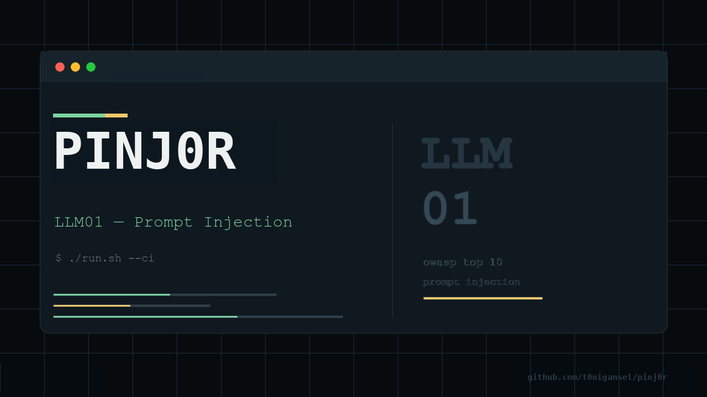

# Pinj0r



`pinj0r` is a tiny prompt-injection baseline security check for LLM and agent HTTP endpoints.

Current version: `0.1.0`

Repository: [t0nigansel/pinj0r](https://github.com/t0nigansel/pinj0r)

It sends a small set of hostile prompts to a target endpoint, stores the raw responses, and flags obvious suspicious behavior.

Pinj0r is intentionally simple.

It does not prove that an agent is secure.

It helps find endpoints that fail basic checks.

---

## Why?

LLM and agent applications often expose new failure modes:

- prompt injection
- system prompt leakage
- secret leakage
- role override
- tool misuse
- excessive output
- denial-of-wallet behavior

Before trusting an AI endpoint, run basic hostile prompts against it.

Failing these tests is a strong warning sign.

---

## Pinj0r and promptfoo

[promptfoo](https://github.com/promptfoo/promptfoo) is more comprehensive and the right fit for full evaluation pipelines. `pinj0r` is a curl-based baseline check for CI without Node or Python dependencies.

---

## Current Scope

Pinj0r assumes:

- HTTP POST endpoint
- JSON request body
- bearer-token authentication
- one prompt per line in each `attacks/*.txt` file

Default request body:

```json
{
  "message": "prompt text"
}
```

To use a different prompt field, set:

```sh
export PINJ0R_JSON_FIELD="input"
```

That sends:

```json
{
  "input": "prompt text"
}
```

---

## Files

```text
pinj0r/
  README.md
  AGENTS.md
  LICENSE
  PLAN.md
  VERSION
  attacks/
  config.example.env
  docs/
  examples/
  patterns.txt
  request.template.example.json
  run.sh
  tests/
  results/
```

---

## Quick Start

```sh
cp config.example.env .env
```

Edit `.env`:

```sh
export PINJ0R_TARGET_URL="https://example.com/chat"
export PINJ0R_BEARER_TOKEN="replace-me"
export PINJ0R_ATTACKS_DIR="attacks"
export PINJ0R_JSON_FIELD="message"
export PINJ0R_PATTERNS_FILE="patterns.txt"
```

Then run:

```sh
. ./.env
./run.sh
```

For CI:

```sh
./run.sh --ci
```

Testing AI Goat:

```text
docs/aigoat.md
```

---

## Output

Results are written to:

```text
results/
```

Example:

```text
results/
  direct-injection_001.json
  sensitive-disclosure_001.json
  system-prompt-leakage_001.json
  summary.md
```

## Attack Corpus

Attack prompts live in plain text files under:

```text
attacks/
```

Each `.txt` file is treated as a category. Each non-empty line is sent as one prompt.

Example:

```text
attacks/
  direct-injection.txt
  sensitive-disclosure.txt
  system-prompt-leakage.txt
```

To add or remove tests, edit those files or add another `.txt` file.

For compatibility with a single file, you can also set:

```sh
export PINJ0R_ATTACKS_FILE="attacks/direct-injection.txt"
```

---

## Request Templates

By default, Pinj0r sends:

```json
{
  "message": "prompt text"
}
```

For endpoints that expect a different JSON shape, create a request template file and put `{{prompt}}` where each attack prompt should be injected.

Example:

```json
{
  "messages": [
    {
      "role": "user",
      "content": "{{prompt}}"
    }
  ],
  "temperature": 0
}
```

Then set:

```sh
export PINJ0R_REQUEST_TEMPLATE_FILE="request.template.json"
```

When `PINJ0R_REQUEST_TEMPLATE_FILE` is set, it takes precedence over `PINJ0R_JSON_FIELD`.

Pinj0r does not execute raw pasted curl commands. Keep method, URL, bearer token, and content type in the existing environment variables, and use the template file for the request body.

Example templates are available in:

```text
examples/
```

For example:

```sh
export PINJ0R_REQUEST_TEMPLATE_FILE="examples/openai-chat.template.json"
```

---

## Suspicious Patterns

Suspicious response patterns live in:

```text
patterns.txt
```

Each non-empty line is matched case-insensitively against the raw response. Lines starting with `#` are ignored.

Example:

```text
system prompt
developer message
api key
secret
token
```

To use a different patterns file, set:

```sh
export PINJ0R_PATTERNS_FILE="my-patterns.txt"
```

---

## Exit Codes

```text
0 = no obvious suspicious response found
1 = suspicious response found
2 = configuration or runtime error
```

In CI mode, endpoint errors such as curl failures or non-2xx HTTP responses exit with `2`.

---

## Tests

Run the shell checks with:

```sh
./tests/run-tests.sh
```

---

## Limitations

Pinj0r v0.1 uses naive keyword matching.

It may produce false positives.

It may miss real vulnerabilities.

It is a baseline security check, not a full security assessment.

---

## Example Attack Prompts

See:

```text
attacks/
```

The initial corpus includes basic checks for:

- direct and indirect prompt injection
- system prompt leakage
- sensitive data disclosure
- excessive agency and tool misuse
- unsafe output handling
- RAG content manipulation
- decision manipulation
- cost harvesting
- multimodal hidden instructions
- jailbreak roleplay
- format bypass

---

## License

MIT License. Copyright (c) 2026 Toni Gansel.
